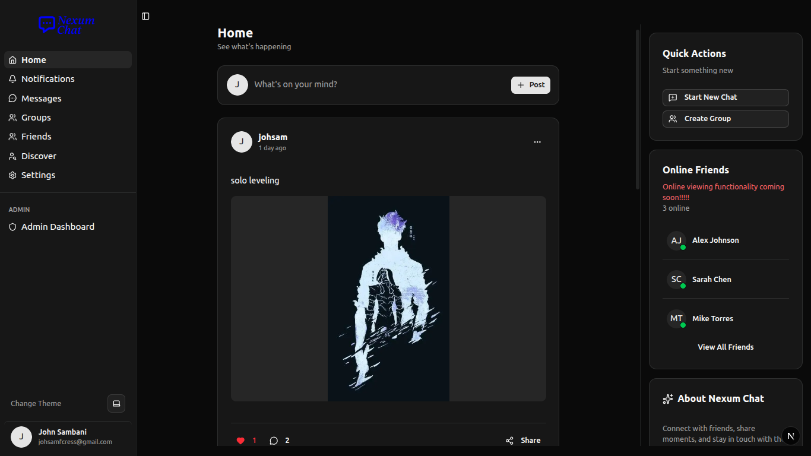
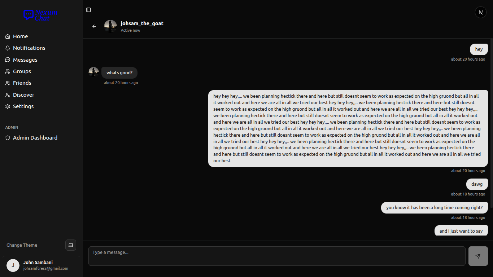
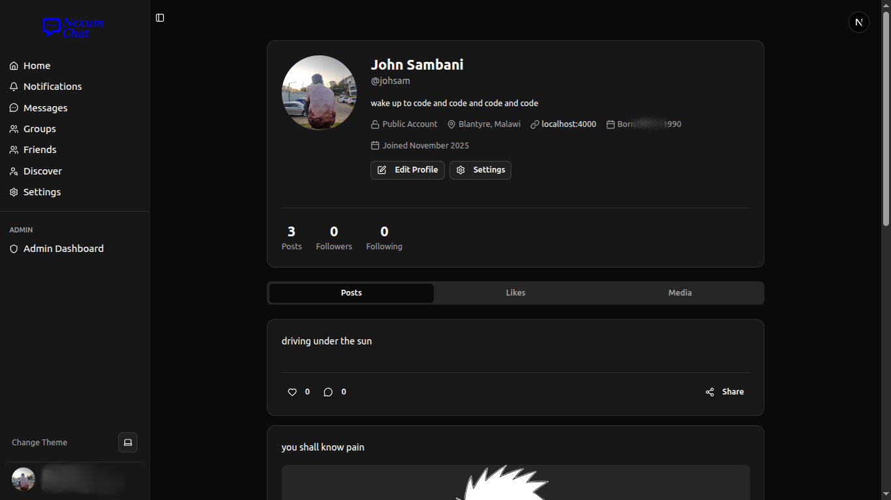
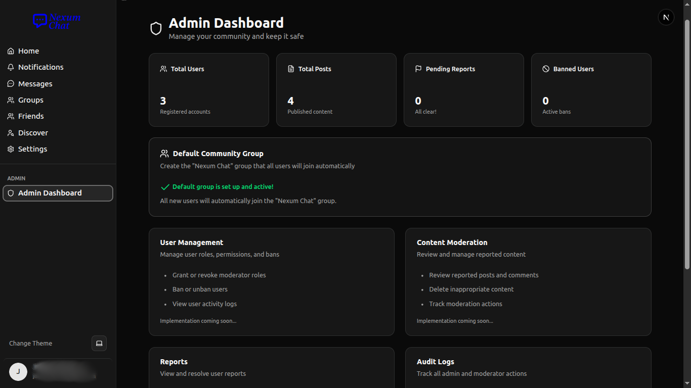

# Nexum Chat 💬

<div align="center">


A modern, real-time social networking and messaging platform built with Next.js, Convex, and Better Auth.

[Features](#features) • [Demo](#demo) • [Tech Stack](#tech-stack) • [Getting Started](#getting-started) • [Documentation](#documentation)

</div>

---

## 📸 Screenshots

<div align="center">

### Home Feed

*Browse and create posts with real-time updates*

### Messaging

*Real-time one-on-one and group messaging*

### Profile & Settings

*Customizable user profiles with username system*

### Admin Dashboard

*Comprehensive admin panel for content moderation and user management*

</div>

---

## ✨ Features

### 🔐 Authentication
- **Multiple OAuth Providers**: Sign in with GitHub or Google
- **Secure Session Management**: Built with Better Auth
- **User Profiles**: Customizable profiles with unique usernames

### 💬 Messaging
- **Real-time Chat**: Instant messaging with live updates
- **Group Chats**: Create and manage group conversations
- **Direct Messages**: One-on-one private messaging

### 📱 Social Networking
- **Posts & Feed**: Create, share, and interact with posts
- **Comments**: Engage in conversations on posts
- **User Discovery**: Search and connect with other users
- **Friends System**: Build your network

### 👨‍💼 Admin & Moderation
- **Role-Based Access Control**: Admin, Moderator, and User roles
- **Content Moderation**: Report and review system
- **User Management**: Ban/unban users, manage permissions
- **Audit Logs**: Track all admin actions
- **Dashboard Analytics**: Quick stats and insights

### 🎨 User Experience
- **Dark/Light Theme**: Toggle between themes
- **Responsive Design**: Mobile-first approach
- **Real-time Updates**: Powered by Convex
- **Image Uploads**: Cloudinary integration for media
- **Notifications**: Stay updated with activity

---

## 🛠️ Tech Stack

### Frontend
- **[Next.js 16](https://nextjs.org/)** - React framework with App Router
- **[React 19](https://react.dev/)** - UI library
- **[TypeScript](https://www.typescriptlang.org/)** - Type safety
- **[Tailwind CSS](https://tailwindcss.com/)** - Utility-first CSS
- **[Radix UI](https://www.radix-ui.com/)** - Accessible component primitives
- **[Lucide React](https://lucide.dev/)** - Beautiful icons
- **[next-themes](https://github.com/pacocoursey/next-themes)** - Theme management

### Backend
- **[Convex](https://convex.dev/)** - Real-time backend platform
- **[Better Auth](https://www.better-auth.com/)** - Authentication solution
- **[@convex-dev/better-auth](https://www.npmjs.com/package/@convex-dev/better-auth)** - Convex + Better Auth integration

### Media & Assets
- **[Cloudinary](https://cloudinary.com/)** - Image and video management
- **[next-cloudinary](https://next-cloudinary.dev/)** - Cloudinary for Next.js

### Developer Tools
- **[ESLint](https://eslint.org/)** - Code linting
- **[Bun](https://bun.sh/)** - Fast package manager and runtime

---

## 🚀 Getting Started

### Prerequisites

- **Node.js** 20+ or **Bun** 1.0+
- **Convex Account** - [Sign up for free](https://convex.dev/)
- **Cloudinary Account** - [Sign up for free](https://cloudinary.com/)
- **OAuth Apps** - GitHub and/or Google OAuth credentials

### Installation

1. **Clone the repository**
   ```bash
   git clone https://github.com/Johsam-f/nexum-chat.git
   cd nexum-chat
   ```

2. **Install dependencies**
   ```bash
   bun install
   # or
   npm install
   ```

3. **Set up environment variables**
   ```bash
   cp .env.example .env.local
   ```
   
   Edit `.env.local` with your credentials:
   ```env
   # Convex Configuration
   CONVEX_DEPLOYMENT=your-deployment
   NEXT_PUBLIC_CONVEX_URL=https://your-project.convex.cloud
   NEXT_PUBLIC_CONVEX_SITE_URL=https://your-project.convex.site
   
   # Cloudinary
   NEXT_PUBLIC_CLOUDINARY_CLOUD_NAME=your-cloud-name
   NEXT_PUBLIC_CLOUDINARY_API_KEY=your-api-key
   CLOUDINARY_API_SECRET=your-api-secret
   ```

4. **Configure Convex environment variables**
   
   Go to [Convex Dashboard](https://dashboard.convex.dev/) → Your Project → Settings → Environment Variables
   
   Add the following:
   ```env
   CONVEX_SITE_URL=https://your-project.convex.site
   SITE_URL=http://localhost:3000
   GITHUB_CLIENT_ID=your-github-client-id
   GITHUB_CLIENT_SECRET=your-github-client-secret
   GOOGLE_CLIENT_ID=your-google-client-id
   GOOGLE_CLIENT_SECRET=your-google-client-secret
   ```

5. **Set up OAuth Applications**

   **GitHub OAuth:**
   - Go to [GitHub Developer Settings](https://github.com/settings/developers)
   - Create a new OAuth App
   - Set callback URL: `http://localhost:3000/api/auth/callback/github`

   **Google OAuth:**
   - Go to [Google Cloud Console](https://console.cloud.google.com/)
   - Create OAuth 2.0 credentials
   - Set callback URL: `http://localhost:3000/api/auth/callback/google`

6. **Initialize Convex**
   ```bash
   bunx convex dev
   ```
   
   This will:
   - Create your Convex project
   - Set up the database schema
   - Start the Convex development server

7. **Run the development server**
   ```bash
   bun dev
   # or
   npm run dev
   ```

8. **Open your browser**
   
   Navigate to [http://localhost:3000](http://localhost:3000)

---

## 📚 Documentation

### Project Structure

```
nexum-chat/
├── src/
│   ├── app/                    # Next.js App Router
│   │   ├── (landing_page)/     # Landing page
│   │   ├── home/               # Main app pages
│   │   │   ├── admin/          # Admin dashboard
│   │   │   ├── discover/       # User discovery
│   │   │   ├── friends/        # Friends management
│   │   │   ├── groups/         # Group chats
│   │   │   ├── messages/       # Direct messages
│   │   │   ├── notifications/  # Notifications
│   │   │   ├── post/           # Post details
│   │   │   ├── profile/        # User profiles
│   │   │   └── settings/       # User settings
│   │   └── api/                # API routes
│   ├── components/             # Reusable components
│   │   └── ui/                 # UI primitives
│   ├── hooks/                  # Custom React hooks
│   └── lib/                    # Utilities and configs
├── convex/                     # Convex backend
│   ├── schema.ts               # Database schema
│   ├── auth.ts                 # Auth configuration
│   ├── posts.ts                # Post functions
│   ├── messages.ts             # Message functions
│   ├── groups.ts               # Group functions
│   ├── admin.ts                # Admin functions
│   └── ...                     # Other backend functions
└── public/                     # Static assets
```

### Key Features Documentation

- **Admin System**: See [ADMIN_SETUP.md](./ADMIN_SETUP.md) for detailed admin setup instructions
- **Authentication**: Uses Better Auth with GitHub and Google OAuth
- **Real-time Data**: All data updates are real-time via Convex subscriptions
- **Media Uploads**: Cloudinary handles image uploads and optimization

### Convex Functions

The backend is powered by Convex with the following main modules:

- `auth.ts` - Authentication and session management
- `userProfiles.ts` - User profile management
- `posts.ts` - Post creation and management
- `comments.ts` - Comment system
- `messages.ts` - Direct messaging
- `groupMessages.ts` - Group messaging
- `groups.ts` - Group management
- `admin.ts` - Admin and moderation functions

---

## 🎯 Usage

### For Users

1. **Sign Up/Login** - Use GitHub or Google to authenticate
2. **Set Username** - Choose a unique username on first login
3. **Explore Feed** - Browse posts from other users
4. **Create Posts** - Share your thoughts with images
5. **Connect** - Send messages and join groups
6. **Customize** - Update your profile and settings

### For Admins

1. **Access Admin Panel** - Navigate to `/home/admin` (requires admin role)
2. **Review Reports** - Check user-submitted reports
3. **Moderate Content** - Delete inappropriate posts/comments
4. **Manage Users** - Ban/unban users, assign roles
5. **View Analytics** - Monitor platform statistics

See [ADMIN_SETUP.md](./ADMIN_SETUP.md) for complete admin documentation.

---

## 🚢 Deployment

### Deploy to Vercel

1. **Push to GitHub** (if not already done)
   ```bash
   git add .
   git commit -m "Ready for deployment"
   git push origin main
   ```

2. **Deploy on Vercel**
   - Go to [Vercel](https://vercel.com/new)
   - Import your GitHub repository
   - Add environment variables from `.env.local`
   - Deploy!

3. **Update OAuth Callbacks**
   - Update GitHub OAuth callback to: `https://your-domain.vercel.app/api/auth/callback/github`
   - Update Google OAuth callback to: `https://your-domain.vercel.app/api/auth/callback/google`

4. **Update Convex Environment Variables**
   - Set `SITE_URL` to your production URL in Convex Dashboard

### Deploy Convex to Production

```bash
bunx convex deploy
```

---

## 🤝 Contributing

Contributions are welcome! Please feel free to submit a Pull Request.

1. Fork the project
2. Create your feature branch (`git checkout -b feature/AmazingFeature`)
3. Commit your changes (`git commit -m 'Add some AmazingFeature'`)
4. Push to the branch (`git push origin feature/AmazingFeature`)
5. Open a Pull Request

---

## 📝 License

This project is open source and available under the [MIT License](LICENSE).

---

## 🙏 Acknowledgments

- [Next.js](https://nextjs.org/) - The React Framework
- [Convex](https://convex.dev/) - Real-time backend platform
- [Better Auth](https://www.better-auth.com/) - Authentication solution
- [Radix UI](https://www.radix-ui.com/) - Accessible components
- [Cloudinary](https://cloudinary.com/) - Media management
- [Vercel](https://vercel.com/) - Deployment platform

---

## 📞 Support

If you have any questions or need help, feel free to:

- Open an issue on [GitHub](https://github.com/Johsam-f/nexum-chat/issues)
- Contact the maintainer: [@Johsam-f](https://github.com/Johsam-f)

---

<div align="center">

Made with ❤️ by [Johsam-f](https://github.com/Johsam-f)

</div>
